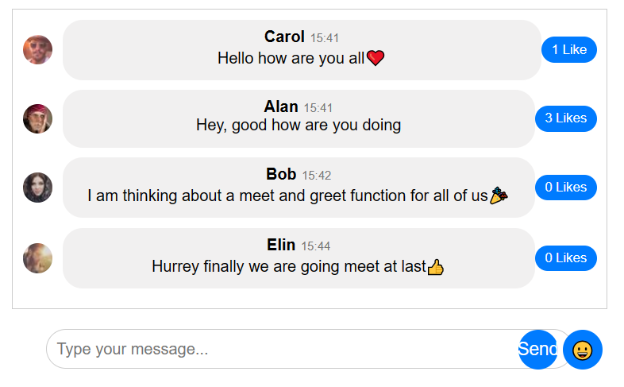
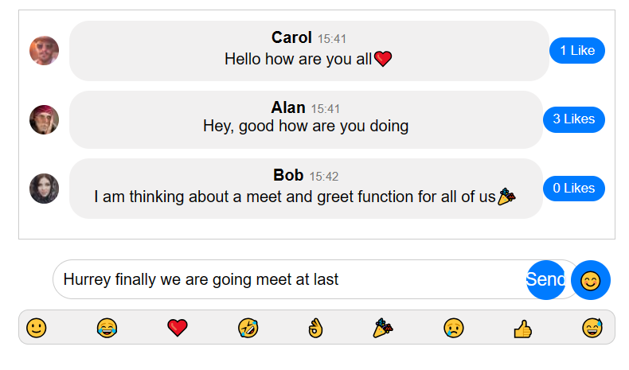

# React Chat App

A simple single-page chat application built with ReactJS.

## Basic Task

This chat application allows users to send messages and see them displayed in the chat thread. Each message is associated with a random username chosen from the predefined list of users. Users can also like a message, and the like count will be displayed next to the like button.

## Stretch Goals

- **Emoji Options:** Users can add emojis to their messages using the emoji icon button in the input text section.


## Screenshots

Before using emoji: 


After using emoji:


## Technologies Used

- ReactJS using vite
- HTML5
- CSS3

## How to start the App
install Dependencies:
```
npm install
```

Start server using:
```
npm run dev
```

## Author
Swarup Karmokar


